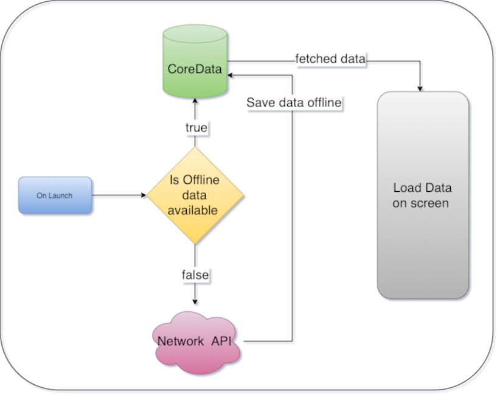
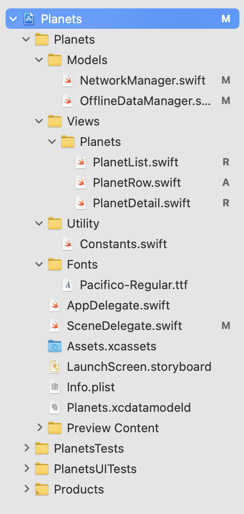
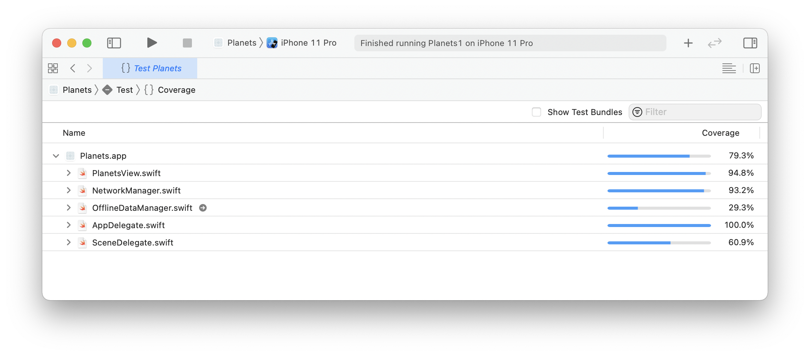
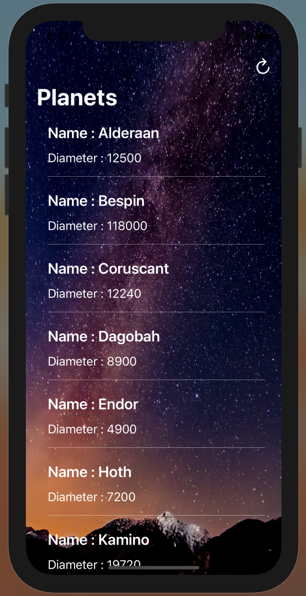
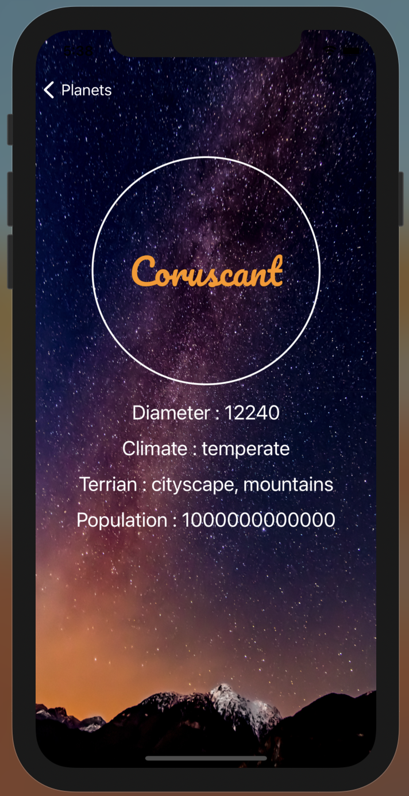
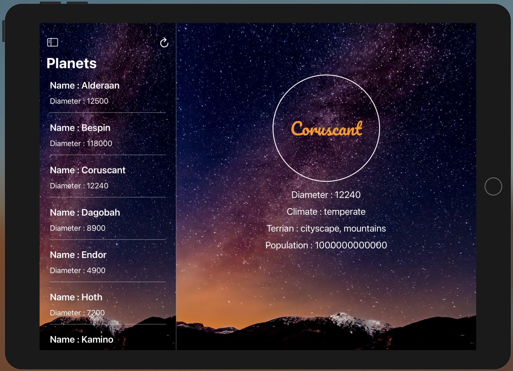
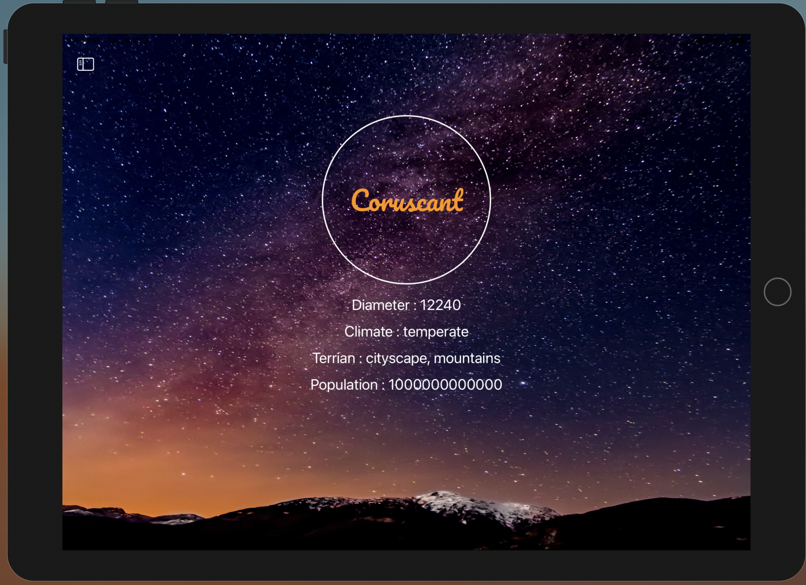
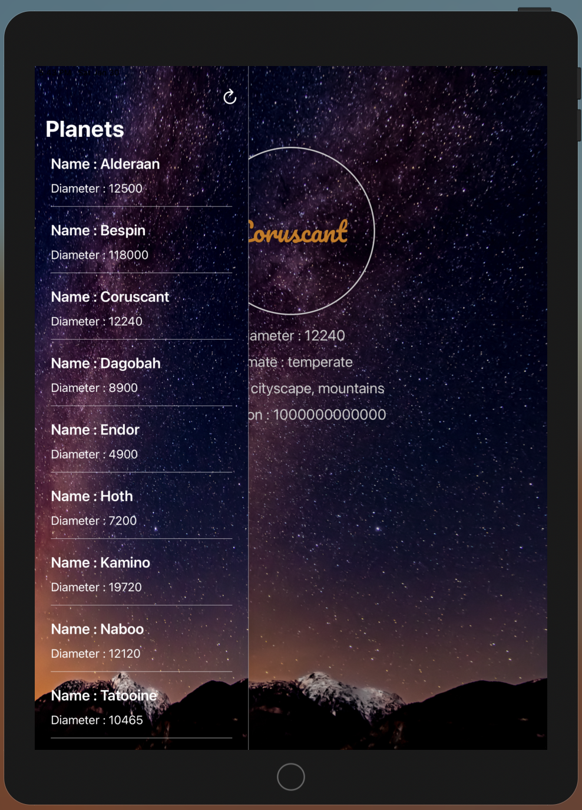
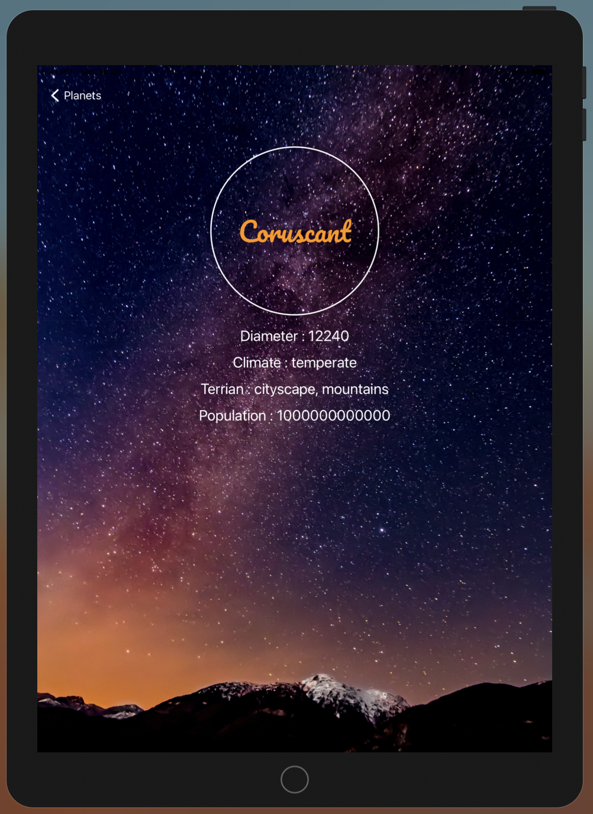

# Planets

## Table of contents
* [Introduction](#introduction)
* [Features](#features)
* [Software And Technologies](#software-and-technologies)
* [Setup](#setup)
* [Approach](#approach)
* [Code Structure And Design Pattern](#code-structure-and-design-pattern)
* [Unit Testing](#unit-testing)
* [Future Features And Improvements](#future-features-and-improvements)
* [Application Screens](#application-screens)

## Introduction:
iOS Application to show Planet List and Details, built with combination of Swift, SwiftUI, UIKit, CoreData.

## Features:
1.	Consumption of API (https://swapi.dev/api/planets/) to fetch the Planet records. (URL Session)
2.	Display the records in a List View. (SwiftUI)
3.	On click of each Planet item from List, Details screen is shown with few details of the selected Planet. (SwiftUI)
4.	Persist the Planet List and Details for Offline Viewing. (Core Data)
5. Universal application.

## Software And Technologies:
* MacOS : Big Sur (11.0.1)
* Xcode: 12.3
* Minimum iOS version: 13.0
* Swift: 5
* SwiftUI
* UIKit
* CoreData

## Setup:
To run this project, open the Planets.xcodeproj in Xcode and you should be able to run it on the desired simulator without any changes(iPhone/iPad).
You will need to configure your development team in the app target's **"Signing & Capabilities"** tab in order to run it on real device.

## Approach:
1.	On the first launch of the app, fetch planet records from the planets API, using **URL Session** data task.
2.	Create the Json object from API response data using **JSONSerialization**.
3.	Save the object from Json data into **Core Data**.
4.	Use **SwiftUI** to show the List of Planets and its details.
5.	On each launch of the app, check if the data is available in offline storage, if yes fetch the data from offline and display, otherwise fetch the data from planet API.
6.	Show Errors using **Alert view** and Labels appropriately.
7.	**Protocols**: Used protocols for notifying the controller about planets data availability and errors.
8.	**Enum**: Used with **Tuple** cases **generic** type for Success and Failure conditions.
9.	**Extensions**: Used for adding more functionality to class and modularizing the code.
10.	**Custom Fonts**: Custom fonts are used in detail screen by adding external font file (**.ttf**)

## Code Structure And Design Pattern:
1.	**PlanetList** – view responsible for displaying the List of planets.
2.	**PlanetRow** – view responsible for creating the Planet List row.
3.	**PlanetDetail** – view responsible for displaying the details of the selected Planet from planet list.
4.	**NetworkManager** - responsible for managing the network call to get the data from the planet API.
5.	**OfflineDataManager** – singleton class responsible for creating the core data stack and managing the CRUD operations of the database.
6.	**Constants** – responsible for maintaining the constants used in app.
7.	**PlanetDataDelegate** - protocol to notify when the Planet List data is available.(Notify Success or Failure)
8.  **Pacifico-Regular.ttf** - custom font file.

  

## Unit Testing: 
Apples **XCTest framework** is used to write the unit tests for the application.
Following image illustrates the **test coverage** of the project.

  

## Future Features And Improvements:
1.	**Load more** feature to fetch the next available records.
2.	Parse and show more details of the planet.
3.	**Pull to refresh** feature would be useful to refresh the data in the List.
4.	**Search** planet functionality.
5.	Unit Tests for Core Data.

## Application Screens:
### 1.	Planet List screen:
  *	This is the landing page (Home Page) of the app, where the list of planets is shown. Each item in the list shows Name of the planet and its Diameter. 
  *	A refresh button at the top-right of the screen is used to fetch the latest records from planets API.
### 2.	Planet Details Screen :
  * This screen shows the details of the selected Planet.
  
  #### iPhone Screens
  

  
  
  

  
  #### iPad Screens
  ##### iPad - Landscape
  

  
  
  

  
  ##### iPad - Portrait   
  

  
  
  

